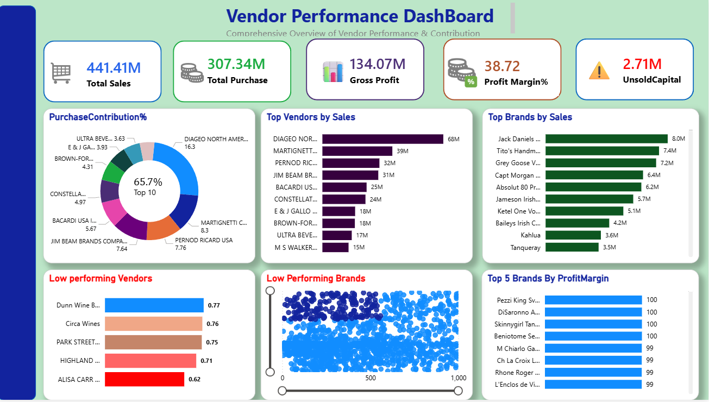

# Vendor Performance Analysis Dashboard

## Project Overview

This project delivers an end-to-end Vendor Performance Analysis solution using SQL, Python, SQLite, and Power BI. The objective is to evaluate vendor efficiency, sales performance, profitability, inventory management, and purchasing patterns to support data-driven business decisions.

The workflow includes data ingestion into a SQLite database, SQL-based aggregation, exploratory data analysis in Python, business metric generation, and interactive dashboard development in Power BI.

---

## Business Problem

Organizations working with multiple vendors need to understand:

- Which vendors contribute the most to purchases and sales?
- Which vendors generate the highest profits?
- Which brands have high margins but low sales potential?
- Which vendors have slow-moving inventory?
- How much capital is locked in unsold inventory?
- Which vendors demonstrate the best inventory turnover?

This project addresses these questions through analytical modeling and interactive reporting.

---

## Tech Stack

### Database
- SQLite
- SQLAlchemy

### Data Analysis
- Python
- Pandas
- NumPy
- SciPy

### Data Visualization
- Matplotlib
- Seaborn

### Business Intelligence
- Power BI

---

## Project Workflow

```text
Raw Data (2+ GB)
        ↓
SQLite Database
        ↓
SQL Aggregations
        ↓
Python EDA & Business Logic
        ↓
Analytical Tables
        ↓
Power BI Dashboard
```

---

## Data Processing

### Data Ingestion
- Loaded multiple CSV datasets into SQLite using SQLAlchemy.
- Automated table creation and data loading process.
- Centralized data storage for SQL analysis.

### SQL Analysis
- Created summary tables using joins, aggregations, and Common Table Expressions (CTEs).
- Consolidated purchase, sales, freight, and vendor information.

### Python Analytics

Generated key business metrics including:

- Gross Profit
- Profit Margin
- Inventory Turnover
- Sales-to-Purchase Ratio
- Unsold Inventory Value
- Purchase Contribution Percentage
- Cumulative Purchase Contribution (Pareto Analysis)

---

## Key Business Questions Answered

### 1. Which vendors contribute the most to total purchase dollars?

Performed Pareto analysis to identify vendors responsible for the largest share of procurement spending.

### 2. Which vendors and brands demonstrate the highest sales performance?

Ranked vendors and products based on total sales revenue.

### 3. Which brands show high profit margins but low sales volume?

Identified potential growth opportunities through margin and sales analysis.

### 4. Which vendors have low inventory turnover?

Detected slow-moving inventory and vendors with excess stock accumulation.

### 5. How much capital is tied up in unsold inventory?

Calculated unsold inventory value to highlight working capital inefficiencies.

---

## Analytical Tables Created

### vendor_summary.csv

Master analytical table containing:

- Vendor Information
- Product Information
- Purchase Metrics
- Sales Metrics
- Profitability Metrics
- Inventory Metrics

### brand_performance.csv

Used for:
- High Margin / Low Sales Opportunity Analysis
- Brand Segmentation

### purchase_contribution.csv

Used for:
- Vendor Purchase Contribution Analysis
- Pareto Chart Visualization

### low_turnover_vendor.csv

Used for:
- Inventory Turnover Analysis
- Slow-Moving Vendor Identification

---

## Dashboard Features

### KPI Cards

- Total Sales
- Total Purchases
- Gross Profit
- Profit Margin
- Unsold Inventory Value

### Vendor Analysis

- Top Vendors by Sales
- Vendor Purchase Contribution
- Vendor Profitability Analysis

### Brand Analysis

- Top Performing Brands
- High Margin Low Sales Opportunities

### Inventory Analysis

- Inventory Turnover Tracking
- Slow-Moving Vendor Detection
- Unsold Capital Monitoring

---

## Dashboard Preview

### Dashboard Overview



---

## Key Insights

- A small number of vendors contribute a significant portion of total purchases.
- Several brands exhibit high profit margins despite low sales volumes, indicating growth opportunities.
- Certain vendors have inventory turnover below industry expectations, suggesting excess stock.
- Significant working capital is tied up in unsold inventory across selected vendors.
- Vendor profitability varies substantially despite similar purchase volumes.

---

## Repository Structure

```text
Vendor-Performance-Analysis/
│
├── notebooks/
│   ├── data_ingestion.ipynb
│   └── eda.ipynb
│
├── exported_tables_dashboard/
│   ├── vendor_summary.csv
│   ├── brand_performance.csv
│   ├── purchase_contribution.csv
│   └── low_turnover_vendor.csv
│
├── powerbi/
│   ├── Vendor_Performance_Dashboard.pbix
│   └── dashboard_screenshot.png
│
├── README.md
├── requirements.txt
└── .gitignore
```

---

## Dataset Information

The original source dataset exceeds 2 GB and is not included in this repository.

The analytical tables used for dashboard development are provided in the `exported_tables_dashboard` directory, allowing the dashboard and analysis workflow to be reviewed without requiring the full raw dataset.

---

## Skills Demonstrated

- SQL Querying
- Database Management
- Data Cleaning
- Exploratory Data Analysis (EDA)
- Statistical Analysis
- Business KPI Development
- Data Visualization
- Power BI Dashboarding
- Business Intelligence Reporting
- End-to-End Analytics Workflow

---

## Author

**Ajay Kumar Swamy Elugubantla**

LinkedIn: https://www.linkedin.com/in/ajay-swamy459

GitHub: https://github.com/Ajay-Swamy

